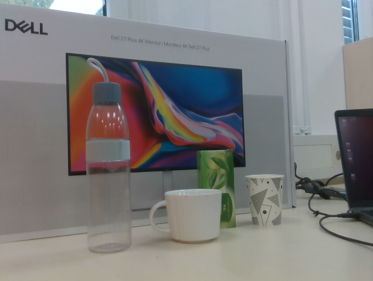
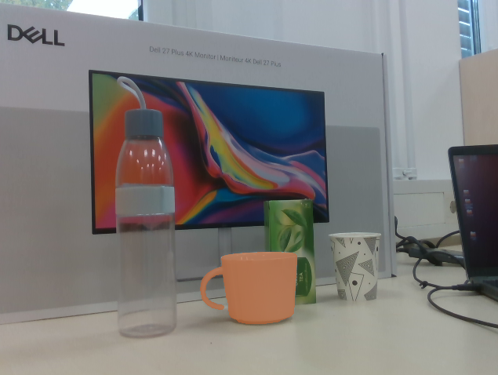
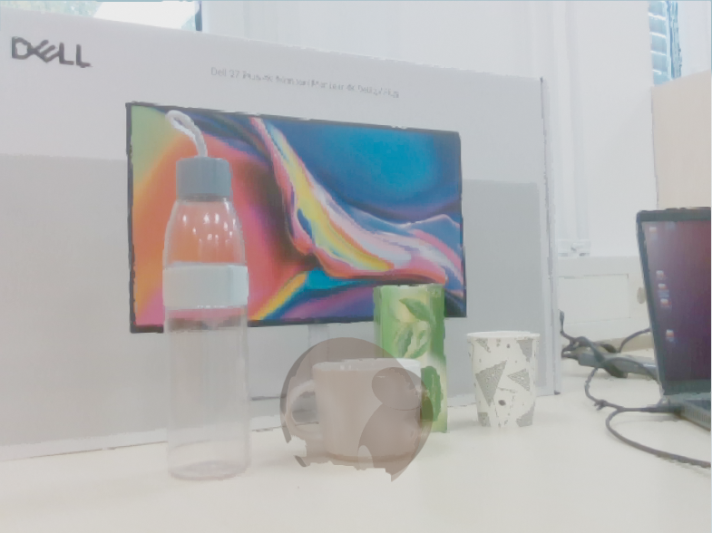
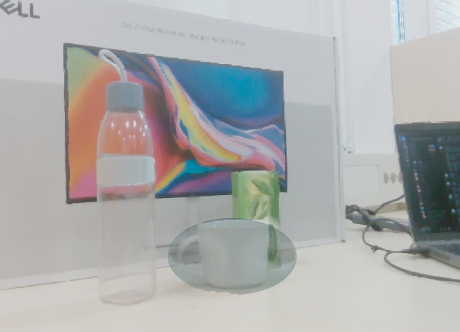

# 🧠 SAM Segmentation and 3D Ellipsoid Visualization with a RealSense Camera

[](https://www.python.org/)
[](https://pypi.org/)
[](LICENSE)

This project demonstrates **image segmentation using Meta’s Segment Anything Model (SAM)** combined with **3D ellipsoid fitting and visualization in Open3D**.  
It performs real-time RGB-D capture using an Intel RealSense camera, interactive segmentation of an object, 3D reconstruction of the segmented region, and Gaussian ellipsoid fitting to represent its spatial distribution.
The SAM2 camera extension is drawn from segment-anything-2 real-time: https://github.com/Gy920/segment-anything-2-real-time

---

## ⚙️ Features

- **Interactive SAM segmentation** — select points directly on the RGB image to segment objects.  
- **Color consistency** — segmentation mask and 3D ellipsoids share the same color for clear correspondence.  
- **3D point cloud reconstruction** — uses aligned RGB-D data from Intel RealSense.  
- **Ellipsoid fitting** — computes Gaussian ellipsoids that enclose a user-defined percentile (e.g., 98%) of segmented points. This is done using sklearn GaussianMixture features. See for example 3D Gaussian Splatting for Real-Time Radiance Field Rendering, Kerbl et al., 2023 https://arxiv.org/pdf/2308.04079 for recent advances in 3D rendering of point clouds using 3D Gaussians. Here, only one image from one point of view is used, unlike modern approaches. Computation time is reduced, but object's depth and shadows create very sparse pointclouds.
- **Open3D visualization** — displays both full scene and fitted ellipsoids in a 3D viewer with lighting and transparency.

---

## ⚡ Installation

Clone the repository and install the required dependencies:

```bash
pip install numpy torch open3d pyrealsense2 opencv-python
```

You also need to install and download the **Segment Anything (SAM)**, as well as the model weights.
See https://github.com/facebookresearch/segment-anything for more information. Put the model in a /model folder. Change the weights path name according to your installation.
For SAM2 installation, check https://github.com/facebookresearch/sam2
If using SAM2 webcam tracking, install: https://github.com/Gy920/segment-anything-2-real-time

---

## 🚀 Run the Script

Run the segmentation and visualization (SAM or SAM2 depending on your install):

```bash
python SAM_segmentation.py
```

Steps:
1. The RealSense camera starts and captures frames. Press a key to select your image. 
2. Select one or more points on the displayed image, the segmentation mask will be build to select the object in these datapoints.
3. SAM predicts a segmentation mask. Press a key to continue.
4. The mask color is used for fitting 3D ellipsoids. You can change K (nb of ellipsoids) and radius_percentile (percentile of datapoints enclosed). First, outliers are removed if chosen (change threshold if needed, or remove option), then a GMM is performed. Finally the covariances matrices are scaled to enclosed the desired percentile of datapoints. 100% leads to include outliers if not removed, adjust outliers removal for your type of scenes.
5. The 3D gaussians are pruned and merge to simplify the output. Change the parameters to change this behaviour.
6. Ellipsoids are created based on the gaussian. A rescaling factor r (default 1.0) can be increased to add "margins" to englobe points that were not or misdetected.
7. Finally Open3D launches an interactive 3D viewer showing:
   - The full point cloud with color from RGB data.
   - The fitted Ellipsoids

You can also run:

```bash
python SAM2_automatic.py
```
to automatically segment all the objects within the maximum distance parameter, without any user selection.

---

## 📂 Project Structure

```
├── images/
│   ├── image.png            # Original RGB image
│   ├── image_seg.png        # Segmentation mask overlay
│   ├── seg_98.png           # 3D ellipsoids enclosing 98% of the segmented points
│   ├── seg_100.png          # 3D ellipsoids enclosing 100%
├── model/
│   ├── sam_vit_b_01ec64.pth # SAM model weights (download separately)
├── scripts/
│   ├── ellipsoid_calculation.py # Utility for Gaussian ellipsoid fitting
├── SAM_segmentation.py       # Main segmentation and visualization script
├── README.md                 # Project documentation
└── LICENSE                   # License file
```

---

## 🖼️ Example Outputs

<div align="center">

### 🔹 Original Image  


---

### 🔹 Segmentation Mask  


---

### 🔹 3D Ellipsoids (98% of segmented points) and point cloud projected in the camera view


---

### 🔹 3D Ellipsoids (100% of segmented points)


</div>

---

## 🧩 Notes

- You can change the **mask color consistency** by editing the `show_mask()` function.  
- The **ellipsoid transparency and surface roughness** are configurable through:  
  ```python
  mat.base_roughness = 0.7
  mat.base_reflectance = 0.1
  mat.base_color = [r, g, b, 0.5]
  ```
- The ellipsoids are fitted using a Gaussian Mixture–based decomposition for accurate spatial approximation. The covariances matrices are then rescaled to enclose a percentile of the data.

---

## 📜 License
This project is licensed under the [MIT License](LICENSE).
